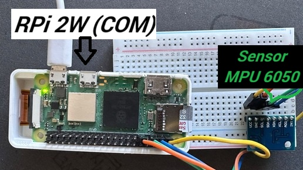
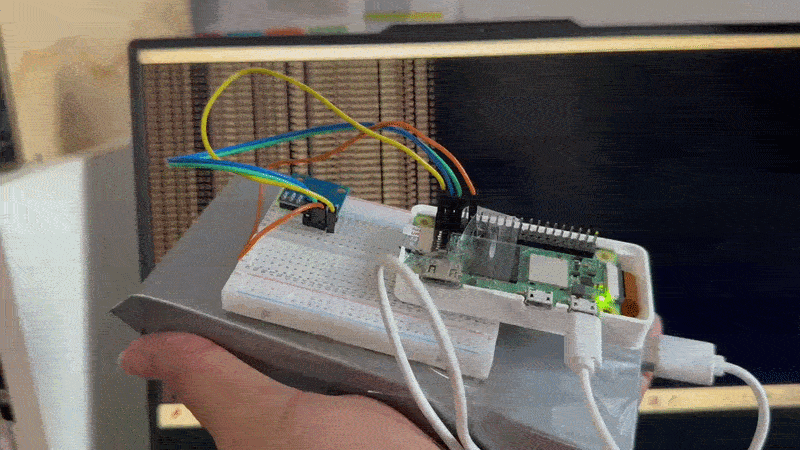
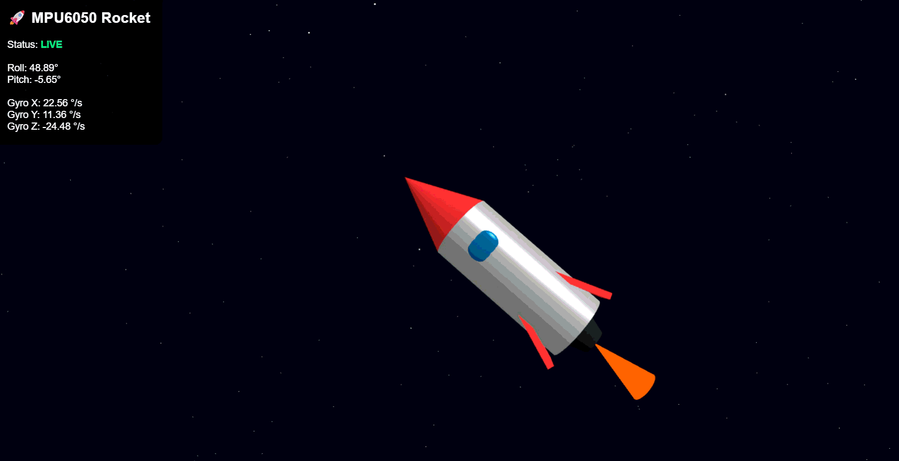

# Real-Time-Digital-Twin
# 🚀 MPU6050 Real-Time Digital Twin

A real-time hardware-to-software digital twin built using a **Raspberry Pi Zero 2 W**, **MPU6050 IMU**, **Python**, **Flask**, and **Three.js**.

The physical MPU6050 sensor measures acceleration and angular velocity. The Raspberry Pi processes the sensor data and exposes it through a web API. A browser-based 3D visualization then represents the physical sensor as a virtual rocket.

When the physical sensor is tilted, the virtual rocket responds in real time.

---




## ✨ Features

* Real-time MPU6050 data acquisition
* Raspberry Pi Zero 2 W
* I²C communication
* Accelerometer measurements
* Gyroscope measurements
* Temperature measurement
* Roll and pitch calculation
* REST API using Flask
* Browser-based visualization
* 3D rocket digital twin using Three.js
* Wi-Fi communication between Raspberry Pi and client device
* No monitor required on the Raspberry Pi

---

<p align="center">
  
</p>

<p align="center">
  
</p>

## 🏗️ System Architecture

```text
┌───────────────────────┐
│      MPU6050          │
│                       │
│ Accelerometer         │
│ Gyroscope             │
│ Temperature           │
└───────────┬───────────┘
            │
            │ I²C
            ▼
┌───────────────────────┐
│ Raspberry Pi Zero 2 W │
│                       │
│ Python                │
│ smbus2                │
│ Flask                 │
└───────────┬───────────┘
            │
            │ Wi-Fi
            ▼
┌───────────────────────┐
│ Web Browser            │
│                        │
│ JavaScript              │
│ Three.js                │
│                        │
│       🚀               │
│ Digital Twin            │
└───────────────────────┘
```

---

## 🧰 Hardware

### Required

* Raspberry Pi Zero 2 W
* MPU6050 / GY-521 compatible module
* Jumper wires
* MicroSD card
* 5V Raspberry Pi power supply
* Wi-Fi network

---

## 🔌 MPU6050 Wiring

| MPU6050 | Raspberry Pi Zero 2 W |
| ------- | --------------------- |
| VCC     | 3.3V — Pin 1          |
| GND     | GND — Pin 6           |
| SDA     | GPIO2 / SDA — Pin 3   |
| SCL     | GPIO3 / SCL — Pin 5   |

The interrupt pin is not required for this implementation.

---

## ⚙️ Raspberry Pi Setup

Enable I²C:

```bash
sudo raspi-config
```

Navigate to:

```text
Interface Options
→ I2C
→ Enable
```

Reboot:

```bash
sudo reboot
```

Check the sensor:

```bash
i2cdetect -y 1
```

A correctly connected MPU6050 normally appears at:

```text
68
```

---

## 🐍 Python Environment

Clone the repository:

```bash
git clone https://github.com/YOUR_USERNAME/mpu6050-digital-twin.git
```

Enter the project:

```bash
cd mpu6050-digital-twin
```

Create a virtual environment:

```bash
python3 -m venv venv
```

Activate it:

```bash
source venv/bin/activate
```

Install dependencies:

```bash
pip install -r requirements.txt
```

---

## ▶️ Running the Project

Start the Flask server:

```bash
python app.py
```

The server listens on:

```text
http://0.0.0.0:5000
```

Find the Raspberry Pi IP address:

```bash
hostname -I
```

For example:

```text
192.168.31.193
```

Open the digital twin from another device on the same network:

```text
http://192.168.31.193:5000/
```

---

## 📡 API

The project exposes the current IMU data through:

```text
GET /imu
```

Example response:

```json
{
    "accel_x": 0.0439,
    "accel_y": 0.1353,
    "accel_z": 1.0581,
    "gyro_x": -2.54,
    "gyro_y": 1.73,
    "gyro_z": 1.02,
    "pitch": -2.36,
    "roll": 7.28,
    "temperature": 28.81
}
```

The browser periodically requests this endpoint and updates the 3D digital twin.

---

## 🧮 Orientation Calculation

Roll and pitch are calculated from the accelerometer's gravity vector.

### Roll

```text
roll = atan2(ay, az)
```

### Pitch

```text
pitch = atan2(
    -ax,
    sqrt(ay² + az²)
)
```

The resulting angles are converted from radians to degrees.

---

## 🎮 Digital Twin

The browser contains a Three.js scene with a custom 3D rocket.

The sensor orientation is mapped to the rocket:

```text
MPU6050 Roll
      ↓
Rocket Z rotation

MPU6050 Pitch
      ↓
Rocket X rotation
```

This creates a visual representation of the physical sensor's orientation.

---

## ⚠️ Current Limitations

This project currently calculates orientation primarily from the accelerometer.

Therefore:

* Roll and pitch are available.
* Yaw is not independently referenced.
* The MPU6050 does not contain a magnetometer.
* Accelerometer integration should not be used as accurate room-position tracking.
* The project does not provide reliable X/Y/Z physical position.

For absolute heading, a magnetometer or another external reference would be required.

For indoor position tracking, technologies such as UWB or optical tracking would be more appropriate.

---

## 🔬 Future Improvements

Possible extensions include:

### Sensor Fusion

Implement:

* Complementary filter
* Madgwick filter
* Extended Kalman Filter

to combine accelerometer and gyroscope data.

### Quaternion Orientation

Use quaternion-based orientation instead of Euler angles to improve 3D rotation handling and avoid gimbal-lock issues.

### Gyroscope Calibration

Measure the stationary gyro bias during startup and compensate for it during operation.

### Magnetometer

Add a magnetometer to provide an absolute heading reference.

### Real-Time WebSocket Streaming

Replace periodic HTTP polling with WebSockets / Socket.IO for more efficient real-time communication.

### Indoor Position Tracking

Add UWB or optical tracking to provide:

```text
X
Y
Z
```

position in addition to orientation.

---

## 📁 Project Structure

```text
mpu6050-digital-twin/
│
├── app.py
├── requirements.txt
├── README.md
├── .gitignore
│
├── templates/
│   └── index.html
│
└── docs/
    └── wiring.md
```
Image/1.png
---

## 🎓 Project Goals

This project demonstrates the integration of:

* Embedded hardware
* Sensors
* I²C communication
* Python
* Linux
* Raspberry Pi
* REST APIs
* Web development
* 3D visualization
* Real-time systems
* Digital twin concepts

It demonstrates how physical-world sensor data can be captured, processed, transmitted over a network, and represented as a virtual object.

---

## 📜 License

This project is available under the MIT License.
